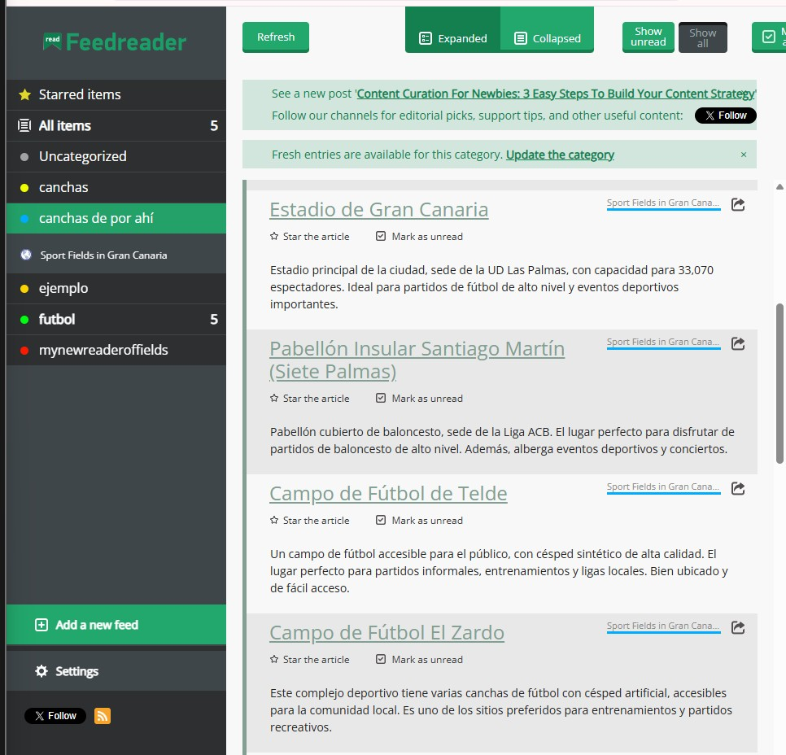

<!-- PROJECT LOGO -->
<br />
<p align="center">
  <a href="https://github.com/GorkaJesus/SPORTS-SPACES">
    
  </a>

  <h1 align="center">Sports Spaces in Gran Canaria</h1>

  <p align="center">
    Discover the best places to practice sports on the island of Gran Canaria.
    <br />
    <a href="https://github.com/GorkaJesus/SPORTS-SPACES"><strong>Explore the documentation »</strong></a>
    <br />
    <br />
    <a href="https://sport-spaces-aa524.web.app/" style="font-size: 1.2em; font-weight: bold;">🌐 Visit the deployed project</a>
  </p>
</p>

---

## 🌟 Deployed Project

The project is available at the following link:  
👉 **[SPORTSPACESSECOND on Firebase Hosting](https://sport-spaces-aa524.web.app/)** 👈

---

## 📖 About the Project

**Sports Spaces in Gran Canaria** is a platform designed for residents and tourists looking for the best outdoor sports spots in Gran Canaria. From surfing to hiking, the website provides detailed information about each location, including maps, tips, and nearby facilities.

This project was developed as part of my studies in **1º DAM** at **IES El Rincón**, applying modern technologies and responsive design principles.

### 🛠️ Built With

- **HTML5** and **CSS3** for structure and styling.
- **JavaScript (ES6+)** for functionality.
- **Leaflet.js** for interactive maps.
- **Bootstrap** for responsive design.
- **Firebase Hosting** for deployment.

---

## 🚀 Getting Started

### Prerequisites

- A modern web browser (Google Chrome, Firefox, etc.).
- Optional: Node.js and Git for local testing.

### Installation

1. Clone the repository:
   ```bash
   git clone https://github.com/GorkaJesus/SPORTS-SPACES
   ```
2. Open the `index.html` file in your browser.

---

## 📋 Key Features

- Interactive map with the best sports spots.
- Detailed information about each location.
- Responsive design for mobile devices.
- Visual inspiration based on [Figma](https://www.figma.com/community/file/897597577856706975).

---

## 🛣️ Roadmap

- [x] Deploy on Firebase Hosting.
- [ ] Add more sports spots.
- [ ] Implement user reviews and ratings.
- [ ] Improve accessibility and SEO.

---

## 📰 RSS Feed Reader

To demonstrate the RSS feed functionality, you can use the following link in any feed reader:

👉 **[RSS Feed Link](https://sport-spaces-aa524.web.app/news.xml)** 👈

### How it works:
1. Copy the RSS feed link: `https://sport-spaces-aa524.web.app/news.xml`.
2. Paste it into your preferred RSS feed reader (e.g., Feedly, Inoreader, or any browser extension).
3. The feed will display a list of news items. Each item links to a specific news article hosted on the app deployed in Firebase.
   - Example URL: `https://sport-spaces-aa524.web.app/news/article-id`.

### Screenshot:
Below is a screenshot of the RSS feed reader displaying the feed items. Each item links to the corresponding news article in the app.

<p align="center">
  
</p>

---

## 🤝 Contributions

Contributions are welcome! If you have ideas to improve this project, follow these steps:

1. Fork the project.
2. Create a branch for your feature (`git checkout -b feature/NewFeature`).
3. Commit your changes (`git commit -m 'Add new feature'`).
4. Push to your branch (`git push origin feature/NewFeature`).
5. Open a Pull Request.

---

## 📞 Contact

Project on GitHub: [SPORTS-SPACES](https://github.com/GorkaJesus/SPORTS-SPACES)

---

## 🏆 Acknowledgements

- [Leaflet.js](https://leafletjs.com/) - Interactive maps.
- [Bootstrap](https://getbootstrap.com/) - CSS framework.
- [FontAwesome](https://fontawesome.com/) - Icons.
- [Figma](https://www.figma.com/) - Design inspiration.
- [Firebase Hosting](https://firebase.google.com/) - Web deployment.
